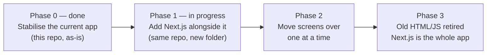

# MarksKhata — Technical Architecture & Engineering Handbook

Status: working draft, last updated 29 Sep 2026 (Phase 1 started — see §2.1). This is the engineering counterpart to `docs/PRODUCT_PRD.md` — that file says what we're building and why; this file says how the code is organised, where things run, and what "environment" means in practice. Written for a non-coder founder handing this to a developer, so every term is explained once, in plain words, before it's used again.

## 0. How to read this document

There are two different codebases in play, on purpose:

1. **The current app** — the working AVETI report-card tool, already live, already used by real teachers. It lives in *this* repository (`sushantailab/aveti-reportcard`), as plain HTML/CSS/JavaScript talking to Supabase. It has real bugs (listed in §7) but real users. **Do not throw it away.**
2. **MarksKhata** — the rebuilt, multi-school, paid product described in the PRD. It reuses the same database (Supabase) and most of the same ideas, but gets a proper Node.js (Next.js) structure so it can support logins, payments and a landing page.

The plan is **not** "delete the old app and write a new one." It's a **strangler fig migration**: a well-known, 20-years-proven pattern where the new system grows up around the old one, page by page, until the old one is fully replaced and can be switched off. At every point in between, the app in production works. This avoids the single biggest risk in a rewrite — a multi-month gap where nothing can be shipped and one bug can take down everything.



Phase 0's fixes are in `sushantailab/aveti-reportcard#1`. Phase 1 has started: `apps/web/` exists, builds, and its landing page and email/password sign-in are wired up against the real database — see §2.1 for exactly what that does and doesn't include yet. The live app at the repo root (`index.html` + `assets/`) is completely untouched by any of this and still serves production.

## 1. Repository, app and domain strategy: one of each — a confirmed decision

This got a real pros/cons review (not just picked by default), because it's actually three separate questions people usually blur together, and each one was decided the same way: merged, not split.

| Question | Decision | Why |
| --- | --- | --- |
| One repo or two? | **One** — `sushantailab/aveti-reportcard` | An earlier PRD draft proposed splitting into `markskhata-website` + `markskhata-app`; superseded. Two repos means two clones, two sets of environment variables, two Vercel projects, two places a bug can hide — real cost for a solo, non-coder founder, for no benefit yet. |
| One Next.js app or two (a separate marketing app and a separate product app)? | **One** — `apps/web/` serves the landing page, auth and the logged-in app together, via "route groups" (§2) | For one deployable app, a second app (or a monorepo tool to manage several) adds build configuration and CI complexity in exchange for nothing. Split into a second app only the day there is a genuine second *deployable* — a mobile app, say — that needs to share code with this one. |
| One domain (path-based, e.g. `markskhata.in/home`) or a subdomain split (`app.markskhata.in`)? | **One domain, path-based** | A subdomain buys independent scaling and a marginal "feels like a dedicated app" security perception, at the cost of wiring up cross-domain login cookies yourself and running two deploys in sync — for a solo founder that cost is real and the benefit isn't yet. Path-based also keeps every page's SEO value on one domain instead of splitting it. |

None of these are permanent. Revisit any one of them the day its actual trigger shows up: a second real app that needs shared code (→ a monorepo tool), a dedicated marketing/growth hire who wants a no-code page builder for the landing page (→ split the marketing site out), or a specific security/compliance reason to isolate the public site from the app holding student data (→ split then, not before).

## 2. Target folder structure

```text
aveti-reportcard/
├── apps/
│   └── web/                        # the one Next.js application — see §2.1 for what's real today
│       ├── app/                    # Next.js "App Router" — one folder per URL
│       │   ├── (marketing)/        # public pages, no login required
│       │   │   ├── page.tsx        # "/" — the landing page
│       │   │   ├── terms/page.tsx
│       │   │   ├── privacy/page.tsx
│       │   │   ├── refunds/page.tsx
│       │   │   └── contact/page.tsx
│       │   ├── (auth)/             # sign-up, login
│       │   │   ├── login/page.tsx
│       │   │   └── signup/page.tsx
│       │   ├── (app)/              # everything behind a login
│       │   │   ├── layout.tsx      # auth check, sign-out; sidebar/nav comes later
│       │   │   ├── home/page.tsx
│       │   │   ├── marks/page.tsx          # not built yet
│       │   │   ├── students/page.tsx       # not built yet
│       │   │   ├── reports/page.tsx        # not built yet
│       │   │   └── settings/billing/page.tsx  # not built yet
│       │   ├── api/                # server-only routes — none exist yet (§4)
│       │   │   ├── razorpay/webhook/route.ts
│       │   │   ├── whatsapp/send/route.ts
│       │   │   └── admin/create-teacher-login/route.ts
│       │   ├── layout.tsx          # root layout: <html>, fonts, metadata defaults
│       │   └── globals.css         # Tailwind v4 entry point (an @import, not a config file)
│       ├── components/             # shared UI pieces
│       │   ├── pricing-table.tsx   # the billing-toggle + per-student calculator
│       │   └── auth-form.tsx       # shared login/signup form
│       ├── lib/                    # non-UI logic, grouped by topic
│       │   ├── supabase/           # client.ts (browser), server.ts, middleware.ts
│       │   ├── auth/actions.ts     # Server Actions: signIn, signUp, signOut
│       │   ├── plans.ts            # the plans table — single source of truth for prices
│       │   ├── centres.ts          # ported from listAccessibleCentres() in the legacy app
│       │   ├── ai/                 # Claude API calls (§5) — not built yet
│       │   ├── billing/            # Razorpay helpers — not built yet
│       │   └── whatsapp/           # Meta WhatsApp Cloud API helpers — not built yet
│       ├── proxy.ts                # session-refresh only (Next.js 16 renamed "middleware" to "proxy" — §2.2)
│       ├── next.config.ts
│       ├── package.json            # this app's own dependencies and lockfile
│       └── .env.local.example      # a template, never real secrets
├── supabase/
│   ├── migrations/                 # already exists — every schema change, in order
│   └── seed.sql                    # optional: sample data for a fresh dev database
├── docs/
│   ├── PRODUCT_PRD.md              # what & why
│   └── ARCHITECTURE.md             # this file — how
├── .github/
│   └── workflows/
│       └── deploy.yml              # existing GitHub Pages workflow — untouched, still deploys the legacy app
├── index.html, assets/, package.json, scripts/   # the CURRENT live app — see §2.3 on why this hasn't moved to legacy/ yet
```

**Why folders are grouped this way (so a new developer isn't guessing):**

- `app/(marketing)`, `app/(auth)`, `app/(app)` — the parentheses mean "this folder doesn't add to the web address, it's just for organising." A visitor sees `markskhata.in/pricing`, not `markskhata.in/marketing/pricing`. Grouping this way means anyone can tell at a glance whether a page needs a login just from which folder it's in.
- `lib/` is never UI. If a file exports a React component, it lives in `components/` or inside `app/`. If it's a function that talks to Supabase, Razorpay, Meta or Claude, it lives in `lib/`. This one rule prevents the single most common mess in growing codebases: business logic scattered inside button click-handlers.
- `lib/plans.ts` exists because the PRD's own numbers drifted across sections more than once while it was being written by hand — one typed file that the landing page, the upgrade screen and the billing code all import removes that failure mode entirely.

### 2.1 What's actually built in `apps/web/` right now

Real and verified (typecheck, lint and `next build` all pass; the auth pages and the `/home` redirect were also checked by hand against the live Supabase project):

- The full landing page (`app/(marketing)/page.tsx`), built from `docs/PRODUCT_PRD.md` § "Landing page — MarksKhata": hero, the problem, how it works, the "what ₹1 replaces" comparison, the pricing section with a working monthly/yearly toggle and a per-student calculator, FAQ, and the footer with (placeholder) legal pages.
- Sign-up and sign-in with a real email + password, via Supabase Auth, using Next.js Server Actions (`lib/auth/actions.ts`) — no client-side fetch/JSON boilerplate, and the Supabase call never runs in the browser.
- A real, server-side auth guard on everything under `app/(app)/`: an unauthenticated visit to `/home` redirects to `/login`, checked on the server on every request, not a client-side gate that JavaScript could skip.
- `/home` itself queries the **same** `centres` / `centre_memberships` / `platform_admins` tables the live app reads, through the **same** Row Level Security policies — this was the point of building it first: proving the new stack reads the existing multi-centre data model correctly before anything else is built on top of it.

Not built yet, on purpose (small, well-defined next steps, not gaps found by accident):

- Google sign-in and the 6-digit email-code flow from the PRD — email + password is the minimum that let the real flow be end-to-end tested now; the fuller flow needs an email provider decision (Brevo vs. Resend) first.
- The school-details screen after sign-up, marks entry, students, reports, billing, WhatsApp — everything in §2's tree marked "not built yet".
- `app/api/*` — no server routes exist yet; nothing calls Razorpay, Meta or Claude.

### 2.2 A framework surprise worth knowing about

`npm install` resolved **Next.js 16**, which is newer than what most training data (including this document's first draft) describes — for example, Next.js renamed `middleware.ts` to `proxy.ts` in this version (same behaviour, new name and export). Next.js 16 knows this and now auto-generates an `AGENTS.md`/`CLAUDE.md` in `apps/web/` on first `next dev`, specifically warning AI coding tools to check `node_modules/next/dist/docs/` before writing code rather than relying on training data — commit these two files rather than fighting them; `next dev` only regenerates them. The concrete lesson for whoever picks this up: **run the actual build and dev server and trust the compiler's errors over half-remembered API shapes** — that's how the proxy rename, an ESLint config incompatibility, and a Turbopack workspace-root warning were all actually found and fixed while building this.

One related, deliberate non-choice: Next.js 16 also ships an opt-in "Cache Components" mode (`cacheComponents: true`) that changes how session-dependent pages are cached (session reads move behind a `<Suspense>` boundary). It is **not** enabled here — with it off, a plain `async` Server Component that calls `cookies()`/`auth.getUser()` is automatically rendered per-request, which is the simpler, correct default for a mark-entry app where almost every authenticated page is genuinely personal anyway. Revisit only if a specific page's load time becomes a real, measured problem.

### 2.3 Why the live app hasn't moved to `legacy/` yet

The original plan named a `legacy/` folder that `index.html` and `assets/` would move into during this phase. That move is deliberately **not done yet**: the repo root's `package.json`, `scripts/build.mjs` and `.github/workflows/deploy.yml` are wired together to deploy the live app to production, and moving those files is a real risk to production for zero benefit at this stage — `apps/web/` works perfectly well as a new, independent folder sitting alongside the untouched live app (two `package.json` files in one repo is completely normal mid-migration; see §10 on why that still doesn't need a monorepo tool). The `legacy/` move happens later, once Phase 2 or 3 is ready to actually retire pages, when there's a real reason to touch the live deploy pipeline.

## 3. Tech stack (confirmed choices)

| Layer | Choice | Why |
| --- | --- | --- |
| Language | TypeScript (not plain JavaScript), `strict: true` | Catches a whole class of bugs (wrong field name, wrong type) before the code ever runs. Costs a little more typing up front, saves debugging time for the rest of the product's life. |
| Framework | Next.js 16 (App Router), on Node.js, with Turbopack | One framework serves the marketing site, the app, and the server-only API routes. Vercel is built by the same company, so deploys are zero-config. |
| Database & auth | Supabase (Postgres + Auth + Storage), via `@supabase/ssr` | Already in place, already has your school/centre/RLS data model. No migration needed. `@supabase/ssr` is the current officially-recommended package for Supabase Auth in the Next.js App Router (not the older, now-superseded `auth-helpers-nextjs`). |
| Hosting | Vercel | Confirmed by you. Free "Hobby" tier is for non-commercial use only — move to Pro ($20/month) at first paying customer (see PRD §"Tech stack & free-tier infrastructure"). |
| Styling | Tailwind CSS v4 | Fast to write, keeps all styling co-located with the component instead of in separate CSS files that drift out of sync. v4 is CSS-first — there is no `tailwind.config.ts`; configuration lives in `app/globals.css` itself via `@import "tailwindcss"` and CSS custom properties. |
| Forms & mutations | Plain HTML forms + Next.js Server Actions + `useActionState`, validated with Zod | The current idiomatic pattern for a Next.js App Router form: no client-side fetch/JSON boilerplate, the mutation runs on the server, and Zod validates before anything touches Supabase. A form library (React Hook Form) is worth adding once a form gets genuinely complex (the mark-entry grid, most likely) — not needed for two-field login/signup forms. |
| Payments | Razorpay (Subscriptions + UPI AutoPay) | Per PRD. Not built yet. |
| Messaging | Meta WhatsApp Cloud API, called directly from `lib/whatsapp/` | Per PRD — no third-party WhatsApp reseller fee. Not built yet. |
| AI | Anthropic Claude API, called only from server routes | Per PRD's AI Insights add-on. Never call it from the browser — that would expose the API key. Not built yet. |
| Testing | Vitest (unit) + Playwright (a handful of end-to-end checks on the money paths: sign-up, mark entry, payment) | Not "100% coverage" — that's a waste of a solo founder's time. Cover the paths where a silent bug costs a customer or costs money. Not set up yet — every check so far has been `tsc --noEmit`, `eslint` and `next build`, which is enough while the app is this small but stops being enough once real money and real marks are on the line. |

## 4. Environments — what the word means and what we use

**"Environment" = a complete, separate copy of the running app + its own database, so that testing something never risks real schools' data.** Three tiers, used by almost every serious product:

| Tier | Where it runs | Database | Who sees it | Purpose |
| --- | --- | --- | --- | --- |
| **Local** | Your (or a developer's) own laptop, `npm run dev` | A separate free Supabase project, `marksKhata-dev` | Only the person coding | Try things, break things, nobody notices |
| **Preview** | Vercel auto-deploys a live link for every proposed change (a "Pull Request") | Same `marksKhata-dev` project | Anyone with the link — good for you to check a change before it goes live | Look at a change in a real browser before approving it |
| **Production** | `markskhata.in`, Vercel's main deployment | `marksKhata-prod` — the real one, real schools' real data | The public | The actual product |

**The one rule that matters most: `marksKhata-dev` and `marksKhata-prod` are two entirely separate Supabase projects, with separate database passwords and separate API keys.** A mistake in development must be physically unable to touch production data. Today, the existing repo has **no dev database at all** — every change is tested against the live one. Fixing that is the very first item in §7.

This is why `apps/web/.env.local` (gitignored, never committed) currently points at the **same** production project, using the same public anon key already shipped in the legacy app's `assets/js/config.js` — reusing it for local Next.js dev is safe (an anon key is meant to be public; it is only ever as safe as the RLS policies behind it) but only ever read-safe by accident, not by design. The moment a separate dev project exists, `apps/web/.env.local` should point at it instead.

### 4.1 Where secrets live (never in the code itself)

A "secret" is anything that, if leaked, lets a stranger spend money, impersonate the app, or read private data: database passwords, the Razorpay secret key, the Meta WhatsApp access token, the Anthropic API key.

| Secret type | Lives in | Never in |
| --- | --- | --- |
| Local development | `.env.local` file on your machine, listed in `.gitignore` so Git never uploads it | Committed to GitHub, ever |
| Preview & Production | Vercel dashboard → Project → Settings → Environment Variables | Hard-coded in any `.ts`/`.js` file |
| CI checks (GitHub Actions) | GitHub repo → Settings → Secrets and variables → Actions | The workflow `.yml` file itself |

A `.env.local.example` file **is** committed — it lists the variable *names* with placeholder values, so a new developer knows what to ask for without ever seeing a real key.

```text
# .env.local.example — copy to .env.local and fill in real values. Never commit .env.local.
NEXT_PUBLIC_SUPABASE_URL=
NEXT_PUBLIC_SUPABASE_ANON_KEY=
SUPABASE_SERVICE_ROLE_KEY=        # server-only. NEXT_PUBLIC_ vars are sent to the browser; this one must never have that prefix.
RAZORPAY_KEY_ID=
RAZORPAY_KEY_SECRET=              # server-only
META_WHATSAPP_TOKEN=              # server-only
ANTHROPIC_API_KEY=                # server-only
```

The `NEXT_PUBLIC_` prefix is Next.js's own rule: any variable named that way is bundled into the code the browser downloads, so it is **visible to anyone**. Every secret that isn't safe to publish stays un-prefixed and is only ever read inside `app/api/*/route.ts` files, which run on Vercel's servers, never in the visitor's browser.

## 5. Where the AI layer lives

The AI Insights add-on (PRD §"Pricing & unit economics") is a server-only feature:

```text
lib/ai/
├── client.ts        # creates the Anthropic client once, reads ANTHROPIC_API_KEY from the server environment
├── classInsight.ts  # builds one prompt per class+subject, calls Claude, returns structured JSON
└── studentNote.ts   # same idea, per student
```

Called only from `app/api/ai/generate-insights/route.ts`, triggered by a scheduled job (Vercel Cron or a Supabase Edge Function) that runs overnight in batch mode, as costed in the PRD. The browser never sees the API key and never calls Claude directly.

## 6. Git workflow (kept deliberately simple for a solo/small team)

- **`main`** is always production. Every commit on `main` is safe to deploy — Vercel deploys it automatically.
- **Feature branches** for anything bigger than a typo fix: `git checkout -b fix/1000-row-bug`. When it's ready, open a Pull Request into `main`.
- **Every Pull Request** automatically gets: a Vercel Preview link (§4) and a CI run (`ci.yml`: install dependencies, typecheck, lint, build). A PR cannot merge if the build fails.
- **Commit messages** follow a simple prefix convention so the history stays readable as it grows: `fix:`, `feat:`, `docs:`, `chore:`. Example: `fix: paginate allResults() past Supabase's 1000-row limit`.
- **No direct pushes to `main`** once a second person (or a hired developer) joins — enforce this with a GitHub branch protection rule (Settings → Branches).

## 7. Phase 0 — fix the current app first (your stated priority)

These are concrete, scoped issues already found in the existing codebase. None require the Next.js rebuild; all can be fixed in the current HTML/JS app this week. Ordered by risk.

1. **Silent data-loss bug in reports.** `allResults()` in `assets/js/core/database.js` fetches marks with no pagination. Supabase caps a single request at 1,000 rows. A school with roughly 100+ students and a term's worth of tests will silently see wrong averages in Insights, Growth and Monthly Report — with no error shown. **Fix before onboarding any real multi-school pilot.**
2. **Permission regression: Centre Admins can delete data.** Migration `20260724_centre_admin_delete_students_and_marks.sql` grants delete rights that contradict the intended model (only the Master/Super Admin deletes; Centre Admins archive). Needs a new migration that revokes it, not an edit to the old one (see §8, "never edit a shipped migration").
3. **No separate development database.** Every change is currently tested against the live database. Create a second free Supabase project today and point local development at it (§4).
4. **No automated backups.** The current Supabase project is on the free tier, which has no backups. Add a nightly `pg_dump` via a scheduled GitHub Action before any paying school's data is at risk.
5. **Unescaped student names in some screens.** A handful of `innerHTML` calls insert student names without escaping (`assets/js/features/home-students.js`, others). Once teacher-entered data can include arbitrary text, this is a stored XSS risk. Reuse the existing `escapeHTML`/`escMonthly` helpers everywhere user-entered text is rendered.
6. **Public sign-up is open.** Anyone can currently create an account from the login screen with no invitation. Turn this off until the self-serve flow (PRD §"Registration & login") replaces it.
7. **Hard-coded Aveti branding.** `assets/js/config.js` and `index.html` hard-code Aveti Learning's name, address and logo. Fine for the current single-tenant app; must become per-centre config before any second paying school onboards (this naturally happens during the Next.js migration, §2's `lib/supabase/`).

## 8. Database (Supabase) conventions — keep, don't rebuild

The existing `supabase/migrations/` folder and its naming (`YYYYMMDD_description.sql`) is a good pattern — keep it exactly as is for both the current app and MarksKhata; they share one database.

- **Never edit a migration file that has already been applied to production.** If something needs to change, write a new migration that alters or corrects it. Migrations are a permanent, ordered history — editing history breaks anyone else's database that already ran the old version.
- **Row Level Security (RLS) is the real security boundary**, not the app's UI. Every table must have RLS on, and every new table needs its policies written and tested (there's already `supabase/rls-test-plan.md` — extend it, don't replace it).
- **The Supabase CLI**, run locally against `marksKhata-dev`, lets you test a migration before it ever touches production: `supabase db reset` replays every migration from scratch into a throwaway local database.

## 9. Glossary (for the non-coder reading this)

| Term | Plain meaning |
| --- | --- |
| Repository ("repo") | The folder of code, tracked by Git, that lives on GitHub. |
| Branch | A parallel copy of the code you can safely experiment on without touching `main`. |
| Commit | A saved snapshot of a change, with a message describing it. |
| Pull Request (PR) | "Here's a change I want to merge into `main` — please look at it first." |
| CI (Continuous Integration) | Robots that automatically check every PR (does it build? does it pass the type checks?) before a human approves it. |
| Deploy | Publishing a version of the code so it's actually running and reachable on the internet. |
| Environment variable | A setting (often a secret) supplied to the running app from *outside* the code, so the same code can behave differently in dev vs. production without being edited. |
| Migration | A single, numbered SQL file that changes the database structure (e.g. "add a column"). Running all migrations in order, from empty, recreates the exact current database shape. |
| RLS (Row Level Security) | A Postgres feature where the *database itself* refuses to return or change a row unless the request meets a rule — e.g. "only if this row's `centre_id` belongs to you." This is what keeps School A from ever seeing School B's students, even if the app's code had a bug. |

## 10. What's explicitly out of scope for now

- Two separate repos (§1) — revisit only if a separate team or stack is needed.
- A monorepo tool (Turborepo, Nx) — unnecessary complexity for one Next.js app; revisit only if a second app (e.g. a mobile app) is added later.
- Kubernetes, Docker, or any self-hosted server — Vercel + Supabase is the right size for this product's traffic for a long time yet.
- Automated test coverage beyond the money paths — see §3's testing row.

## 11. Bilingual, multi-board & onboarding (MarksKhata productisation)

This section records the design agreed in the Sep 2026 planning session for turning the
single-tenant Aveti app into the multi-tenant MarksKhata product. It is the source of
truth for the board model, the onboarding fields, the language (medium) system, and the
per-centre customisation layer. Build order is at the end.

### 11.1 Two independent axes: board (data) vs language (display)

The single most important design point: **board and language are separate concerns.**

- **Board** decides *which* curriculum data applies — the set of subjects and the fixed
  chapter list with fixed serial numbers. A board is really `board + curriculum`:
  - **CBSE – NCERT** — CBSE board following NCERT books. Fixed chapters, fixed order. (Default.)
  - **Odisha Board (Odia)** — the single Odia-medium state curriculum (BSE Odisha). Fixed.
  - **CBSE – Other books (non-NCERT)** — CBSE board, but the school uses other publishers'
    books (grades 1–8) that are *aligned to* NCERT, plus extras NCERT has no equivalent for
    (e.g. a standalone English Grammar book). Grades 9–10 are NCERT-mandatory nationwide.
- **Language / medium** decides *what language the labels are shown in* — English or Odia.
  It is a display preference, not a data selector. A CBSE school can teach in Odia medium;
  an Odisha-board school can teach in English. Every catalogue entry and every UI label
  therefore carries **both** an English and an Odia value; language just switches which is shown.

Consequence: the translation workbook has a `title_en` column and a `title_or` column per
chapter; the UI string table has an `en` and an `or` value per key. Filling the Odia side
never duplicates rows — it only fills a column. (Workbook delivered:
`MarksKhata_Translation.xlsx`, generated from the live DB, classes 3–9, 308 CBSE-NCERT chapters.)

### 11.2 The curriculum data model: shared master + per-centre custom

Confirmed decision (see §11.6): move from **per-centre chapter copies** to **one shared
master catalogue, bilingual, keyed by board**, with a thin **per-centre customisation layer**
on top. The picker a teacher sees = `master(board) ∪ this centre's custom rows`.

- **Master catalogue** (shared, read-only reference, bilingual):
  - `curriculum_chapters(board, class_level, subject, chapter_no, title_en, title_or)`
  - `curriculum_subjects(board, class_level, subject_key, name_en, name_or)`
  These are populated by importing the translated workbook. All centres on a board read them.
- **Per-centre customisation** (already half-exists via the `chapters.centre_id` column):
  - Custom **chapters** — already shipped: the "+ Add new chapter" button writes a per-centre
    row into `chapters`. Extended with `title_or` for a bilingual custom title.
  - Custom **subjects** — NEW: `centre_subjects(centre_id, class_level, subject, name_or)`.
    Mirrors "add chapter". Solves the non-NCERT case (e.g. add "English Grammar" under Class 6,
    then add its chapters). No publisher modelling — the master list is the aligned starting
    point, and the two "add your own" buttons cover every mismatch.

Why this is low-risk: existing tests snapshot `chapter_names[]` onto the test row itself
(`20260723_periodic_tests.sql`), so historical reports do not depend on the live catalogue.
The picker's *source* can move to the master table without touching past data; the old
per-centre `chapters` rows stay as each centre's custom layer.

### 11.3 Onboarding & the `centres` table

New columns on `public.centres` (all additive, safe defaults so existing rows keep working):

| Column | Meaning |
|---|---|
| `board text default 'CBSE-NCERT'` | one of `CBSE-NCERT`, `Odisha-Board`, `CBSE-Other` |
| `centre_type text default 'coaching'` | `school` or `coaching` (tuition) |
| `class_levels int[] default '{}'` | classes the centre runs, e.g. `{5,6,7,8,9,10}` |
| `language text default 'en'` | default display language: `en` or `or` |

Flows (same field set, one shared form component):
- **Public signup — minimal:** email, password, centre name, phone, **type, board, classes,
  language**. Address / logo / centre-head deferred to "Customize profile" later. (Public
  signup is currently disabled in the live app; the fields land in the super-admin form first.)
- **Super-admin manual create** (`centreAdmin()` → `createCentreFromAdmin()`): same fields,
  filled by the operator. This is the immediate target for the live app.

`centre_type` drives the School Exam feature (§11.5). `board` selects the catalogue (§11.2).
`class_levels` drives the home-page table (§11.4). `language` seeds the display language.

### 11.4 Home page = live grid from the centre's classes + subjects

When a centre's `class_levels` are known, the home page renders that centre's own table:
centre name + logo, classes down the side, subjects across the top, each cell showing how
many tests were conducted (type + count). English data already maps this way; the same
render runs in Odia once strings + catalogue are translated.

### 11.5 Test taxonomy & the School Exam split

- Rename the product-neutral label: **"Aveti test" → "Test Marks"**; drop the hardcoded
  "Aveti" special-casing in `shared.js` (`displayCentreName`).
- Test types (translatable via `Test_Types`): Chapter-End Test (Unit Test), Term 1,
  Half-Yearly, Term 3, Annual.
- Full-marks options extended to `[20,25,30,35,40,60,80]` (60 & 80 newly added). Durations
  unchanged (free `duration_minutes`).
- **School Exam** (already scaffolded in `20260807_school_exam_results.sql`: `schools`,
  `student_school_enrolments`, `school_exam_results`) is shown **only for `centre_type =
  coaching`** — a tuition centre tracks the marks its students got in their school's
  term/half-yearly/annual, to compare against its own tests. For a `school` centre those
  exams *are* its Test Marks, so the School Exam button is hidden.
- Multi-school tuition case is already solved: `student_school_enrolments` ties each student
  to one school per session, so school is captured once on the student, not per mark entry.

### 11.6 Confirmed decisions (Sep 2026 session)

- Catalogue model: **one shared master table, bilingual, per board.** (Not per-centre copies.)
- Language switch: **centre default + live per-user EN/Odia toggle.** Report language selectable.
- Full-marks: **add 60 and 80.** Durations unchanged.
- Board dropdown wording: **CBSE – NCERT / Odisha Board (Odia) / CBSE – Other books (non-NCERT).**
- Non-NCERT handled by **Add-your-own-subject + Add-your-own-chapter**, not publisher modelling.

### 11.7 Build order

1. **DB migration** — centre fields (§11.3) + `centre_subjects` + `chapters.title_or`. (Additive.)
2. **Onboarding UI** — board (3-way) / type / classes (multi-select) / language on the
   super-admin create + edit centre forms; wire `createCentre`/`updateCentre`/`CENTRE_COLS`.
3. **Add-your-own-subject** — mirror "Add chapter"; merge `centre_subjects` into `subjectsForClass`.
4. **Rename Aveti → Test Marks**, fix test-type taxonomy, add full-marks 60/80.
5. **Master catalogue tables + import** the translated workbook (needs Sushant's Odia columns).
6. **i18n string engine + toggle** — `t(key)` dictionary `{en,or}`; import translated strings.
7. **Home-page live grid**, then **bilingual reports & WhatsApp templates**.

Steps 1–4 are English-only and ship to the live app now. Steps 5–7 depend on the translated
workbook. The DB layer (steps 1, 5) is shared by both the live app and the future Next.js app,
so none of it is wasted.
