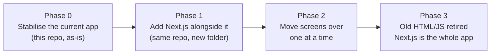

# MarksKhata — Technical Architecture & Engineering Handbook

Status: working draft, 29 Sep 2026. This is the engineering counterpart to `docs/PRODUCT_PRD.md` — that file says what we're building and why; this file says how the code is organised, where things run, and what "environment" means in practice. Written for a non-coder founder handing this to a developer, so every term is explained once, in plain words, before it's used again.

## 0. How to read this document

There are two different codebases in play, on purpose:

1. **The current app** — the working AVETI report-card tool, already live, already used by real teachers. It lives in *this* repository (`sushantailab/aveti-reportcard`), as plain HTML/CSS/JavaScript talking to Supabase. It has real bugs (listed in §7) but real users. **Do not throw it away.**
2. **MarksKhata** — the rebuilt, multi-school, paid product described in the PRD. It reuses the same database (Supabase) and most of the same ideas, but gets a proper Node.js (Next.js) structure so it can support logins, payments and a landing page.

The plan is **not** "delete the old app and write a new one." It's a **strangler fig migration**: a well-known, 20-years-proven pattern where the new system grows up around the old one, page by page, until the old one is fully replaced and can be switched off. At every point in between, the app in production works. This avoids the single biggest risk in a rewrite — a multi-month gap where nothing can be shipped and one bug can take down everything.



## 1. Repository strategy: one repo, not two

An earlier draft of the PRD proposed two repositories (`markskhata-website`, `markskhata-app`). **That is superseded.** Reasons to keep one repo (`sushantailab/aveti-reportcard`, renamed later if you like):

- You are not a coder yet. Two repos means two places to clone, two sets of environment variables, two Vercel projects, two places a bug can hide. One repo is one thing to keep in your head.
- Next.js can serve both the public marketing pages (`markskhata.in`) and the logged-in app (`markskhata.in/app/...` or a subdomain) from the **same deployment**, using "route groups" (explained in §2). You do not need separate hosting to keep them visually and technically separate.
- A single repo means a single CI pipeline, a single source of truth for the database schema, and one Vercel project to pay for instead of two.

Split into two repos later **only if**: a separate team owns the marketing site, or the marketing site needs a totally different tech stack (e.g. a CMS). Neither applies today.

## 2. Target folder structure (Phase 2+, Next.js)

This is where the repo is heading. It does not exist yet — §7 and §8 describe how we get there without breaking the live app.

```text
aveti-reportcard/
├── apps/
│   └── web/                        # the one Next.js application
│       ├── app/                    # Next.js "App Router" — one folder per URL
│       │   ├── (marketing)/        # public pages, no login required
│       │   │   ├── page.tsx        # "/" — the landing page
│       │   │   ├── pricing/page.tsx
│       │   │   ├── terms/page.tsx
│       │   │   └── privacy/page.tsx
│       │   ├── (auth)/             # sign-up, login, forgot password
│       │   │   ├── login/page.tsx
│       │   │   └── signup/page.tsx
│       │   ├── (app)/              # everything behind a login
│       │   │   ├── layout.tsx      # sidebar, nav, auth check
│       │   │   ├── home/page.tsx
│       │   │   ├── marks/page.tsx
│       │   │   ├── students/page.tsx
│       │   │   ├── reports/page.tsx
│       │   │   └── settings/billing/page.tsx
│       │   └── api/                # server-only routes (§4)
│       │       ├── razorpay/webhook/route.ts
│       │       ├── whatsapp/send/route.ts
│       │       └── admin/create-teacher-login/route.ts
│       ├── components/             # shared UI pieces (buttons, tables, cards)
│       ├── lib/                    # non-UI logic, grouped by topic
│       │   ├── supabase/           # database client + typed queries
│       │   ├── ai/                 # Claude API calls (§5)
│       │   ├── billing/            # plan limits, Razorpay helpers
│       │   └── whatsapp/           # Meta WhatsApp Cloud API helpers
│       ├── public/                 # images, favicon, robots.txt
│       ├── next.config.ts
│       ├── package.json
│       └── .env.local.example      # a template, never real secrets
├── supabase/
│   ├── migrations/                 # already exists — every schema change, in order
│   └── seed.sql                    # optional: sample data for a fresh dev database
├── docs/
│   ├── PRODUCT_PRD.md              # what & why
│   └── ARCHITECTURE.md             # this file — how
├── .github/
│   └── workflows/
│       ├── ci.yml                  # lint + typecheck + build on every PR
│       └── deploy.yml              # existing GitHub Pages workflow — retired at cutover
└── legacy/                         # the CURRENT app moves here in Phase 1 (unchanged)
    ├── index.html
    └── assets/
```

**Why folders are grouped this way (so a new developer isn't guessing):**

- `app/(marketing)`, `app/(auth)`, `app/(app)` — the parentheses mean "this folder doesn't add to the web address, it's just for organising." A visitor sees `markskhata.in/pricing`, not `markskhata.in/marketing/pricing`. Grouping this way means anyone can tell at a glance whether a page needs a login just from which folder it's in.
- `lib/` is never UI. If a file exports a React component, it lives in `components/` or inside `app/`. If it's a function that talks to Supabase, Razorpay, Meta or Claude, it lives in `lib/`. This one rule prevents the single most common mess in growing codebases: business logic scattered inside button click-handlers.
- `legacy/` is deliberate, not embarrassing. It's the visible, honest record of "this still works, don't touch it casually" during the migration. It gets deleted in Phase 3.

## 3. Tech stack (confirmed choices)

| Layer | Choice | Why |
| --- | --- | --- |
| Language | TypeScript (not plain JavaScript) | Catches a whole class of bugs (wrong field name, wrong type) before the code ever runs. Costs a little more typing up front, saves debugging time for the rest of the product's life. |
| Framework | Next.js (App Router), on Node.js | One framework serves the marketing site, the app, and the server-only API routes. Vercel is built by the same company, so deploys are zero-config. |
| Database & auth | Supabase (Postgres + Auth + Storage) | Already in place, already has your school/centre/RLS data model. No migration needed. |
| Hosting | Vercel | Confirmed by you. Free "Hobby" tier is for non-commercial use only — move to Pro ($20/month) at first paying customer (see PRD §"Tech stack & free-tier infrastructure"). |
| Styling | Tailwind CSS | Fast to write, keeps all styling co-located with the component instead of in separate CSS files that drift out of sync. |
| Forms & validation | React Hook Form + Zod | Zod schemas double as the "shape" checked both in the browser and again on the server — never trust the browser alone. |
| Payments | Razorpay (Subscriptions + UPI AutoPay) | Per PRD. |
| Messaging | Meta WhatsApp Cloud API, called directly from `lib/whatsapp/` | Per PRD — no third-party WhatsApp reseller fee. |
| AI | Anthropic Claude API, called only from server routes | Per PRD's AI Insights add-on. Never call it from the browser — that would expose the API key. |
| Testing | Vitest (unit) + Playwright (a handful of end-to-end checks on the money paths: sign-up, mark entry, payment) | Not "100% coverage" — that's a waste of a solo founder's time. Cover the paths where a silent bug costs a customer or costs money. |

## 4. Environments — what the word means and what we use

**"Environment" = a complete, separate copy of the running app + its own database, so that testing something never risks real schools' data.** Three tiers, used by almost every serious product:

| Tier | Where it runs | Database | Who sees it | Purpose |
| --- | --- | --- | --- | --- |
| **Local** | Your (or a developer's) own laptop, `npm run dev` | A separate free Supabase project, `marksKhata-dev` | Only the person coding | Try things, break things, nobody notices |
| **Preview** | Vercel auto-deploys a live link for every proposed change (a "Pull Request") | Same `marksKhata-dev` project | Anyone with the link — good for you to check a change before it goes live | Look at a change in a real browser before approving it |
| **Production** | `markskhata.in`, Vercel's main deployment | `marksKhata-prod` — the real one, real schools' real data | The public | The actual product |

**The one rule that matters most: `marksKhata-dev` and `marksKhata-prod` are two entirely separate Supabase projects, with separate database passwords and separate API keys.** A mistake in development must be physically unable to touch production data. Today, the existing repo has **no dev database at all** — every change is tested against the live one. Fixing that is the very first item in §7.

### 4.1 Where secrets live (never in the code itself)

A "secret" is anything that, if leaked, lets a stranger spend money, impersonate the app, or read private data: database passwords, the Razorpay secret key, the Meta WhatsApp access token, the Anthropic API key.

| Secret type | Lives in | Never in |
| --- | --- | --- |
| Local development | `.env.local` file on your machine, listed in `.gitignore` so Git never uploads it | Committed to GitHub, ever |
| Preview & Production | Vercel dashboard → Project → Settings → Environment Variables | Hard-coded in any `.ts`/`.js` file |
| CI checks (GitHub Actions) | GitHub repo → Settings → Secrets and variables → Actions | The workflow `.yml` file itself |

A `.env.local.example` file **is** committed — it lists the variable *names* with placeholder values, so a new developer knows what to ask for without ever seeing a real key.

```text
# .env.local.example — copy to .env.local and fill in real values. Never commit .env.local.
NEXT_PUBLIC_SUPABASE_URL=
NEXT_PUBLIC_SUPABASE_ANON_KEY=
SUPABASE_SERVICE_ROLE_KEY=        # server-only. NEXT_PUBLIC_ vars are sent to the browser; this one must never have that prefix.
RAZORPAY_KEY_ID=
RAZORPAY_KEY_SECRET=              # server-only
META_WHATSAPP_TOKEN=              # server-only
ANTHROPIC_API_KEY=                # server-only
```

The `NEXT_PUBLIC_` prefix is Next.js's own rule: any variable named that way is bundled into the code the browser downloads, so it is **visible to anyone**. Every secret that isn't safe to publish stays un-prefixed and is only ever read inside `app/api/*/route.ts` files, which run on Vercel's servers, never in the visitor's browser.

## 5. Where the AI layer lives

The AI Insights add-on (PRD §"Pricing & unit economics") is a server-only feature:

```text
lib/ai/
├── client.ts        # creates the Anthropic client once, reads ANTHROPIC_API_KEY from the server environment
├── classInsight.ts  # builds one prompt per class+subject, calls Claude, returns structured JSON
└── studentNote.ts   # same idea, per student
```

Called only from `app/api/ai/generate-insights/route.ts`, triggered by a scheduled job (Vercel Cron or a Supabase Edge Function) that runs overnight in batch mode, as costed in the PRD. The browser never sees the API key and never calls Claude directly.

## 6. Git workflow (kept deliberately simple for a solo/small team)

- **`main`** is always production. Every commit on `main` is safe to deploy — Vercel deploys it automatically.
- **Feature branches** for anything bigger than a typo fix: `git checkout -b fix/1000-row-bug`. When it's ready, open a Pull Request into `main`.
- **Every Pull Request** automatically gets: a Vercel Preview link (§4) and a CI run (`ci.yml`: install dependencies, typecheck, lint, build). A PR cannot merge if the build fails.
- **Commit messages** follow a simple prefix convention so the history stays readable as it grows: `fix:`, `feat:`, `docs:`, `chore:`. Example: `fix: paginate allResults() past Supabase's 1000-row limit`.
- **No direct pushes to `main`** once a second person (or a hired developer) joins — enforce this with a GitHub branch protection rule (Settings → Branches).

## 7. Phase 0 — fix the current app first (your stated priority)

These are concrete, scoped issues already found in the existing codebase. None require the Next.js rebuild; all can be fixed in the current HTML/JS app this week. Ordered by risk.

1. **Silent data-loss bug in reports.** `allResults()` in `assets/js/core/database.js` fetches marks with no pagination. Supabase caps a single request at 1,000 rows. A school with roughly 100+ students and a term's worth of tests will silently see wrong averages in Insights, Growth and Monthly Report — with no error shown. **Fix before onboarding any real multi-school pilot.**
2. **Permission regression: Centre Admins can delete data.** Migration `20260724_centre_admin_delete_students_and_marks.sql` grants delete rights that contradict the intended model (only the Master/Super Admin deletes; Centre Admins archive). Needs a new migration that revokes it, not an edit to the old one (see §8, "never edit a shipped migration").
3. **No separate development database.** Every change is currently tested against the live database. Create a second free Supabase project today and point local development at it (§4).
4. **No automated backups.** The current Supabase project is on the free tier, which has no backups. Add a nightly `pg_dump` via a scheduled GitHub Action before any paying school's data is at risk.
5. **Unescaped student names in some screens.** A handful of `innerHTML` calls insert student names without escaping (`assets/js/features/home-students.js`, others). Once teacher-entered data can include arbitrary text, this is a stored XSS risk. Reuse the existing `escapeHTML`/`escMonthly` helpers everywhere user-entered text is rendered.
6. **Public sign-up is open.** Anyone can currently create an account from the login screen with no invitation. Turn this off until the self-serve flow (PRD §"Registration & login") replaces it.
7. **Hard-coded Aveti branding.** `assets/js/config.js` and `index.html` hard-code Aveti Learning's name, address and logo. Fine for the current single-tenant app; must become per-centre config before any second paying school onboards (this naturally happens during the Next.js migration, §2's `lib/supabase/`).

## 8. Database (Supabase) conventions — keep, don't rebuild

The existing `supabase/migrations/` folder and its naming (`YYYYMMDD_description.sql`) is a good pattern — keep it exactly as is for both the current app and MarksKhata; they share one database.

- **Never edit a migration file that has already been applied to production.** If something needs to change, write a new migration that alters or corrects it. Migrations are a permanent, ordered history — editing history breaks anyone else's database that already ran the old version.
- **Row Level Security (RLS) is the real security boundary**, not the app's UI. Every table must have RLS on, and every new table needs its policies written and tested (there's already `supabase/rls-test-plan.md` — extend it, don't replace it).
- **The Supabase CLI**, run locally against `marksKhata-dev`, lets you test a migration before it ever touches production: `supabase db reset` replays every migration from scratch into a throwaway local database.

## 9. Glossary (for the non-coder reading this)

| Term | Plain meaning |
| --- | --- |
| Repository ("repo") | The folder of code, tracked by Git, that lives on GitHub. |
| Branch | A parallel copy of the code you can safely experiment on without touching `main`. |
| Commit | A saved snapshot of a change, with a message describing it. |
| Pull Request (PR) | "Here's a change I want to merge into `main` — please look at it first." |
| CI (Continuous Integration) | Robots that automatically check every PR (does it build? does it pass the type checks?) before a human approves it. |
| Deploy | Publishing a version of the code so it's actually running and reachable on the internet. |
| Environment variable | A setting (often a secret) supplied to the running app from *outside* the code, so the same code can behave differently in dev vs. production without being edited. |
| Migration | A single, numbered SQL file that changes the database structure (e.g. "add a column"). Running all migrations in order, from empty, recreates the exact current database shape. |
| RLS (Row Level Security) | A Postgres feature where the *database itself* refuses to return or change a row unless the request meets a rule — e.g. "only if this row's `centre_id` belongs to you." This is what keeps School A from ever seeing School B's students, even if the app's code had a bug. |

## 10. What's explicitly out of scope for now

- Two separate repos (§1) — revisit only if a separate team or stack is needed.
- A monorepo tool (Turborepo, Nx) — unnecessary complexity for one Next.js app; revisit only if a second app (e.g. a mobile app) is added later.
- Kubernetes, Docker, or any self-hosted server — Vercel + Supabase is the right size for this product's traffic for a long time yet.
- Automated test coverage beyond the money paths — see §3's testing row.
