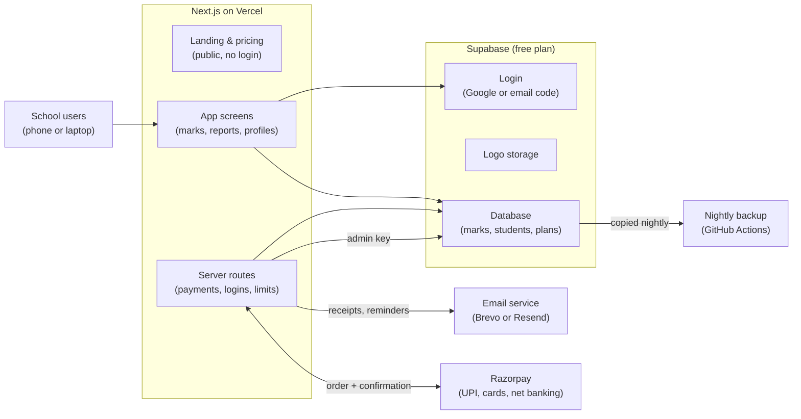

# PRD — Landing Page, Free Signup & Upgrade Flow

Sep 28, 2026 · @Sushant

> **Status:** working draft, last updated 29 Sep 2026. This file is a snapshot exported from the live, editable version of this PRD:
> https://claude.ai/code/artifact/56275e60-8057-4e7a-959d-76a3fd025cf0
> Edit there for comments and history, then re-export to update this file.

## Overview

The landing page has one job: get a school owner or tuition-centre owner to register free and enter their first test's marks within 10 minutes. Everything else (pricing, payment, AI) follows from that first "aha" moment: seeing a class report and a parent report card seconds after typing marks.

**Product:** MarksKhata — a simple web app where schools and tuition centres save every test's marks and instantly get teacher reports, parent report cards on WhatsApp, and year-long progress per student and class. No AI in v1.

**Who it is for:**

- Owners and principals of low-budget private schools (Classes 1–10, CBSE or State Board)
- Tuition-centre owners running regular chapter tests
- Most will open the page on a phone, from a WhatsApp link, on 4G

**The problem we sell against:** marks are written in a register, a rank is announced, and the data is lost. No one can answer a parent's "Is my child improving?", and weak chapters are found too late for remedial classes.

**Success metrics (first 3 months after launch):**

| Metric | Target |
| --- | --- |
| Landing visit → clicks "Start free" | 10% |
| "Start free" → verified account | 50% |
| Verified → first test's marks entered within 7 days (activation) | 40% |
| Activated schools still entering marks after 30 days | 60% |
| Free schools that upgrade within 6 months | 10% |

## Landing page — MarksKhata

The page sells one idea: your students' test marks are worth keeping, and keeping them costs about ₹1 per student per month. It is one scrolling page, mobile first, and every section ends with the same button: **Start free**. Copy below is a first draft in English; Hindi and Odia versions come later.

**Brand line:** "MarksKhata — the khata for your students' marks." Every shopkeeper keeps a khata so no rupee is forgotten. MarksKhata does the same for every mark. The page shows this comparison instead of explaining it.

**Who the page speaks to, and what each gets**

| Reader | Their worry today | What they get from MarksKhata |
| --- | --- | --- |
| School owner or principal | "I cannot see which classes or teachers are improving." | One screen for every class and subject across the year. Marks stay safe when a teacher leaves. |
| Teacher | "Totals, averages and ranks take my evening." | Enter marks in about 3 minutes. Class report, ranks and weak students appear at once. |
| Tuition-centre owner | "Parents ask 'is my child improving?' and I have no answer." | A WhatsApp report card with your logo after every test. Parents see progress, so students stay. |
| Parent | "I only hear 'he is doing fine'." | Marks, trend and weak chapters after every test, on their phone. |

**1. Hero**

- Headline, test two versions: "Every test mark, kept. Every student's progress, visible." against "Stop losing your students' test marks."
- Sub-headline: "MarksKhata is the digital khata for school and tuition test marks. Enter marks in about 3 minutes. Get a class report, a parent report card on WhatsApp and each student's progress for the whole year."
- Price line, large, under the buttons: "Free for 50 students. After that, about ₹1 per student per month."
- Buttons: **Start free** (primary) and **See a sample report** (opens a sample parent card and class report with made-up names)
- Trust strip: "Built at Aveti Learning tuition centre, Bhubaneswar · Each school sees only its own data · No card needed"
- Visual: a phone showing the parent report card next to a laptop showing the class report

**2. The problem, in khata language**

- Headline: "You would never forget a rupee owed. Why forget a mark earned?"
- Three cards: "Marks go into a register and are never seen again." · "A parent asks 'is my child improving?' and nobody can show them." · "Weak chapters are found at the annual exam, too late for a remedial class."

**3. How it works** (3 steps, a screenshot each)

1. Add your students: type them in or upload an Excel/CSV file.
2. Enter marks after every chapter test, on a phone, in about 3 minutes.
3. Share and act: send report cards to parents on WhatsApp and see who needs a remedial class today.

**4. What ₹1 replaces**

| Today | With MarksKhata |
| --- | --- |
| Marks in a register that gets lost or thrown away | Every mark of every student and every test, kept and searchable |
| Teacher adds totals, averages and ranks by hand | Calculated the moment marks are saved |
| Report cards written or printed by hand | A branded WhatsApp report card in one tap, no printing |
| Weak chapters found at the annual exam | Weak students and chapters visible the day after the test, so a remedial class starts at once |
| "Is my child improving?" has no answer | A trend line for every student in every subject |
| Half-yearly and annual marks kept in a separate place | Chapter tests, school exams, class average and topper in one student profile |

Time saved per test is left blank until measured: run three tests at Aveti Learning with a stopwatch, and publish only that number ("\[X\] minutes saved per test").

**5. The price, in rupees per student**

One idea, repeated: about ₹1 per student per month, when your plan is full.

| Plan | Students | Monthly | Yearly | Per student per month, paying monthly | Per student per month, paying yearly |
| --- | --- | --- | --- | --- | --- |
| Free | up to 50 | ₹0 | ₹0 | ₹0 | ₹0 |
| Starter | up to 150 | ₹149 | ₹1,499 | ₹0.99 | ₹0.83 |
| Basic | up to 300 | ₹349 | ₹3,499 | ₹1.16 | ₹0.97 |
| Standard | up to 750 | ₹699 | ₹6,999 | ₹0.93 | ₹0.78 |
| School | up to 2,000 | ₹1,499 | ₹14,999 | ₹0.75 | ₹0.62 |

Yearly is pre-selected and labelled "less than ₹1 per student per month". A price calculator under the cards asks "How many students do you have?" and shows the plan and the real cost per student: 200 students on Basic is ₹349 ÷ 200 = ₹1.75. Copy rule: say "about ₹1" and "when your plan is full", never "only ₹1" for every school.

**6. What one student is worth** (example; the page lets visitors type their own fee)

A tuition centre charges ₹800 per student per month and has 100 students. Basic costs ₹3,499 a year. One student who stays the whole year pays ₹9,600. If clear progress reports help keep even one student who would have left, the year's cost is covered more than twice over. A slider on the page ("Your monthly fee per student") shows "one student kept = ₹X a year" for the visitor's own number.

**7. Proof**

- The Aveti Learning story: "Built at our own tuition centre and used every week." Fill in only real figures: \[N\] students, \[N\] tests recorded, \[N\] parent report cards sent, plus a teacher or parent quote used with permission.
- Sample parent report card and class report with made-up names.
- No invented review counts, no borrowed school logos.

**8. FAQ** (collapsible)

- Is it really free? Yes, up to 50 active students, with no time limit and no card.
- Why is it so cheap? We do one job: keep marks and show progress. No ads, and we never sell your data.
- What happens above 50 students? Everything you already entered stays. To add more students, you pick a plan. If you grow again later, you upgrade in one tap and pay only the difference for the days left.
- Do I need to install anything? No. It works in the browser on any phone or computer.
- Who can see my data? Only the logins you create. Each school sees only its own data.
- Is WhatsApp sending automatic? Sharing by hand is free on every plan. Paid plans also include automatic messages every month (50 to 500), and you can top up from ₹49 for 100 messages.
- Can I cancel? Yes, any time from Settings or from PhonePe AutoPay. Your data stays safe and readable.
- Can I download my data? Yes, as Excel/CSV, any time.
- Can teachers use it? Yes. You get a teacher login that can enter marks but not delete anything.

**9. Final call to action and footer**

- Headline: "Start keeping your marks today. Your first 50 students are free." + **Start free**
- Footer links (required for Razorpay approval): Pricing, Terms of Service, Privacy Policy, Refund & Cancellation Policy, Contact Us (email, phone, address)

**Page requirements**

- Loads in under 2 seconds on a 4G phone; images compressed (WebP), no heavy animation
- A sticky **Start free** button on mobile, and a WhatsApp chat button for questions
- Price calculator and "one student kept" slider working without sign-in
- Every number on the page is either a price from the plans table or a figure we measured; no invented statistics
- Basic SEO: page title "MarksKhata – Test Marks & Progress Report App for Schools and Tuition Centres", a description, and a WhatsApp/Facebook preview image
- Free analytics (Microsoft Clarity or Google Analytics) tracking each step of the funnel in the Overview, and the two headline versions tested against each other

## Registration & login

Two ways to sign up, both free and both verified by email only (no phone OTP, no WhatsApp API): **Continue with Google** (one tap, Google has already verified the email) or **email + password** with a 6-digit code sent to that email.

**Flow**

1. Visitor clicks **Start free** anywhere, or picks a plan on the pricing section.
2. Plan screen shows Free, Basic and Standard; Free is pre-selected. A paid pick still creates a free account first, then goes to payment after setup.
3. Sign-up screen:
   - **Continue with Google**, or
   - Email + password (minimum 8 characters) → a 6-digit code is emailed → user types the code → verified. "Resend code" unlocks after 60 seconds; the code expires in 10 minutes.
4. School details screen (one screen, 5 fields):

| Field | Required | Notes |
| --- | --- | --- |
| School / centre name | Yes | Shown on every report |
| Type | Yes | School or Tuition centre |
| Your name | Yes | Becomes the School Admin |
| City | Yes | For our records and support |
| WhatsApp number | No | Not verified; used only for support messages |

5. Tick box: "I agree to the Terms and Privacy Policy and confirm our school has parents' consent to store students' marks." (needed under India's DPDP Act, 2023)
6. Account is created: a new school on the Free plan, with this person as its School Admin. They land in onboarding.

**Login page**

- **Continue with Google** and email + password on the same screen
- **Forgot password?** link beside the password box → enter email → reset link emailed → set a new password
- Teacher logins (created by the School Admin inside the app) sign in with **school code + username + password**, so teachers without email can still log in. Teachers cannot reset their own password; the School Admin resets it.
- Public sign-up creates a new school only; nobody can join an existing school without being invited by its School Admin.

**Emails the system sends**

| Email | When |
| --- | --- |
| Verification code | Sign-up with email |
| Welcome + 3 first steps | After school details are saved |
| Password reset link | Forgot password |
| Payment receipt | After each successful payment |
| Auto-pay renewal reminder | 3 days before each automatic charge; also when a charge fails |

All emails go from our own address (for example noreply@\[productdomain\]) through a free email-sending service. The built-in Supabase email sender is limited to a few emails per hour and is not usable for real sign-ups.

## First-time onboarding

A new School Admin reaches their first report in 4 guided steps, about 10 minutes. Each step can be skipped and finished later from a checklist on the home screen.

1. **School profile** — upload logo and a school photo (the photo becomes the banner on the school's home screen and on its own login page; both are shrunk automatically, to about 200 KB for the photo and 50 KB for the logo), address, phone. Each school gets its own login link, for example app.\[domain\]/dav-bbsr, showing its photo and logo, so teachers see their own school when they sign in. Grading bands start with defaults (A 80–100, B 60–79, C 40–59, D below 40) and can be changed later.
2. **Classes & subjects** — tick the classes the school runs (1–12) and the subjects per class from a ready list; add a custom subject if needed.
3. **Add students** — three options: type names one by one, paste a list, or upload the Excel/CSV template (downloadable on the same screen). A counter shows "32 of 50 free students used".
4. **Enter your first test** — guided with pop-up tips pointing at each box in turn:
   - "Pick the class and subject"
   - "Pick the chapter and full marks"
   - "Type each student's marks; tick Absent if they missed it"
   - "Click Save & generate reports"
5. **Success screen** — "Your first report is ready." Buttons: **View class report**, **Send parent cards on WhatsApp**, **Create a teacher login**.

**Home checklist** (shown until all are done, then hidden):

- [ ] Add school logo and photo
- [ ] Add students
- [ ] Enter first test
- [ ] Share a parent report on WhatsApp
- [ ] Create a teacher login

**Help that stays available:** a "?" button on the mark-entry screen replays the tips, and a "Help" link opens a WhatsApp chat with our support number.

## Plans, limits & auto-pay

Schools set up payment once and it renews automatically, like Jio or Amazon Prime. The school approves a UPI AutoPay mandate once in PhonePe (or Google Pay, Paytm, BHIM). After that we charge monthly or yearly with no action from them. They get a reminder before every charge and can cancel any time.

**Plans**

| Plan | Active students | Teacher logins | Automatic WhatsApp messages included per month | Monthly auto-pay | Yearly auto-pay (2 months free) |
| --- | --- | --- | --- | --- | --- |
| Free | up to 50 | 1 | None (free manual share only) | ₹0 | ₹0 |
| Starter | up to 150 | 2 | 50 | ₹149 | ₹1,499 |
| Basic | up to 300 | 3 | 100 | ₹349 | ₹3,499 |
| Standard | up to 750 | 5 | 250 | ₹699 | ₹6,999 |
| School | up to 2,000 | 15 | 500 | ₹1,499 | ₹14,999 |
| AI Insights add-on | any paid plan | — | — | ₹199 | ₹1,999 |

Yearly costs about 17% less than 12 monthly payments. Above 2,000 students: "Contact us". All plans have the same features; only the student and login limits differ. Archived students (for example last year's) do not count. Each school's billing cycle starts on the day it first pays, not on 1 April.

**How auto-pay works**

- PhonePe needs no separate integration. Razorpay Subscriptions supports UPI AutoPay, and the school picks PhonePe (or any UPI app) in the Razorpay window. One integration covers every UPI app.
- The first payment and the mandate approval happen together: the school scans the QR code or enters its UPI ID, then approves AutoPay once with its UPI PIN.
- Monthly plans are charged on the same date every month. Yearly plans are charged on the same date next year.
- Every price is under ₹15,000, so renewals go through without the school entering its PIN again (RBI rule for recurring payments).
- Card auto-pay (credit and debit) is supported by Razorpay for most Indian cards: switch it on in a later release. Net banking auto-pay (e-NACH) takes several days to register: later too.

**Upgrade flow**

1. Triggers: a banner at 80% of the plan's student limit (40 of 50 on Free, 120 of 150 on Starter); a pop-up when the school tries to add one student over the limit; an **Upgrade** button always in Settings.
2. Plan screen: pick a plan, then Monthly or Yearly (Yearly pre-selected, showing the saving).
3. Billing details: school name and email (pre-filled), address, GSTIN (optional). These go on every receipt.
4. Razorpay window opens on UPI AutoPay: the school picks PhonePe, Google Pay, Paytm or BHIM and approves the mandate and first payment.
5. Razorpay confirms to our server (webhook). The server checks the signature, then sets the plan and the next renewal date. The browser alone can never activate a plan.
6. Success screen + receipt emailed automatically.

**Renewals and reminders**

| When | What happens |
| --- | --- |
| 3 days before a charge | Email + in-app banner: "₹699 will be auto-debited on 12 Nov for your Standard plan. Cancel any time in Settings." |
| 24 hours before | The school's UPI app (PhonePe etc.) sends its own pre-debit notice; this is automatic and required by RBI |
| Renewal date | Razorpay charges; receipt emailed; plan extended by one month or one year |
| Charge fails | Razorpay retries automatically; school gets a "Payment failed" email with a link to pay or set up auto-pay again; plan stays active for a 7-day grace period |
| Grace period ends unpaid | School moves to read-only mode (below) if it has more than 50 students; all data kept |

**Cancel or change plan**

- Cancel any time from Settings → Billing in our app, or from the AutoPay section of PhonePe. The plan stays active until the end of the period already paid; no partial refunds.
- Upgrade: takes effect immediately; the school pays only the difference for the days left (see Upgrading when students grow, below).
- Downgrade, or switching between Monthly and Yearly: takes effect at the next renewal.

**Upgrading when students grow**

A school never loses access when it outgrows its plan. It pays only the difference for the days left in its current period, gets the bigger limit at once, and keeps the same renewal date. Nothing is ever upgraded or charged without the school pressing **Upgrade**.

1. **Warning:** at 80% of the limit, a banner appears: "You have 120 of 150 students. Basic allows up to 300 for ₹349 a month."
2. **Limit reached:** adding one student over the limit opens the upgrade pop-up. For 14 days the school can still add up to 10% more (165 on Starter), so an admission week never stops work. Marks entry and reports for existing students never stop.
3. **Upgrade screen:** shows the new plan, today's one-time difference, and the new amount that will auto-debit from the next renewal date.
4. **Pay the difference today:** (new price − current price) × days left in the current period ÷ days in the period, rounded up to the nearest rupee. Paid by UPI, card or net banking.
5. **Approve the new AutoPay:** the old AutoPay approval covers only the old amount, so the school approves the new amount once in PhonePe with its UPI PIN. The old AutoPay is cancelled automatically, so nobody is charged twice.
6. **Done:** the new limit applies within seconds of Razorpay's confirmation, a receipt is emailed, and the renewal date stays the same.

| Situation | Pay today | Then auto-debit |
| --- | --- | --- |
| Starter monthly (₹149) paid on 1 Oct; upgrades to Basic on 16 Oct, 15 of 30 days left | (₹349 − ₹149) × 15 ÷ 30 = ₹100 | ₹349 on 1 Nov and every month after |
| Starter yearly (₹1,499) paid on 1 Apr; upgrades to Basic yearly on 1 Oct, 6 of 12 months left | (₹3,499 − ₹1,499) × 6 ÷ 12 = ₹1,000 | ₹3,499 on 1 Apr next year |
| Free school adds its 51st student | Full price of the chosen plan (nothing to credit) | That plan's price every month or year from today |

**Moving down** happens only at renewal. 30 days before each renewal, if the school's active students fit a smaller plan (for example after archiving last year's students in April), it gets an email: "You now have 140 active students. Switch to Starter and save ₹200 a month." One tap sets the switch for the renewal date. Pointing schools to a cheaper plan builds trust and lowers cancellations.

**How it runs on Razorpay (to confirm with Razorpay before building):** the difference is a one-time payment; the new plan is a new subscription that starts on the old renewal date; the old subscription is set to cancel at the end of its current cycle. Check whether Razorpay's subscription-update feature can do this in one step instead.

**Pay once instead (fallback):** a school that does not want auto-pay can pay the yearly price once by UPI, card or net banking. It gets reminder emails 7 days and 1 day before expiry, each with a **Pay again** link.

**When a plan ends** (cancelled, a failed payment not fixed within the 7-day grace period, or a pay-once plan expired):

- A school with 50 or fewer active students simply continues on the Free plan, with full use.
- A school with more than 50 active students moves to **read-only mode**: it keeps every mark it ever entered, but cannot add new ones until it renews.

| In read-only mode the school can | It cannot |
| --- | --- |
| Log in as admin or teacher and see every student, test, report, student profile and class insight | Add new tests or marks |
| Download all its data as Excel/CSV and reports as PDF | Add new students |
| Re-share existing reports with the free WhatsApp share button | Send through MarksKhata WhatsApp (unused top-up credits stay saved for when it renews) |

- Admin banner on every screen: "Your Basic plan ended on 12 Nov. All your data is safe. Renew to add new marks." + **Renew**. Paying restores full access within seconds, with nothing lost.
- Teacher banner: "New marks are paused. Ask your school admin to renew."
- The school can also archive students down to 50 and continue on Free.
- Reminder emails: on the day the plan ends, then after 7, 30 and 90 days.
- Data is kept for at least 24 months after the plan ends. Before anything is deleted, the school gets 30 days' notice with a download link.

**Super admin controls** (for you only): see every school's plan, status (active, grace, cancelled), next charge date and payment history; extend or change a plan by hand for special cases, such as a pilot school.

**Before going live with Razorpay:**

- Complete Razorpay KYC (PAN, bank account) and publish the Terms, Privacy, Refund and Contact pages from the landing page footer; Razorpay checks these before approving the account.
- Ask Razorpay to switch on Subscriptions and UPI AutoPay for your account; this is a separate approval from normal payments.
- Razorpay's standard fee is about 2% per charge, including each automatic renewal.
- Check with a CA whether GST registration is needed; for services it is usually required only above ₹20 lakh turnover a year.

## WhatsApp messaging

Every school can share reports on WhatsApp by hand for free. Schools that want automatic sending use message credits, and MarksKhata sends from its own WhatsApp Business number. One credit = one message to one parent, whether text or PDF.

**Three ways to send**

| Mode | How it works | Who it suits | Cost to the school |
| --- | --- | --- | --- |
| 1. Manual share (every plan, including Free) | Teacher taps **Share**; WhatsApp or WhatsApp Web opens with the message typed and the report link; the teacher presses Send for each parent | Small schools, tight budgets | Free |
| 2. MarksKhata WhatsApp (automatic, paid plans only) | Teacher taps **Send**, for one class or in bulk; MarksKhata's WhatsApp Business number sends to every chosen parent at once, with the school's name in each message | Schools that want no manual effort | Included messages per plan, then top-up packs |
| 3. School's own WhatsApp Business number (later release) | School connects its own verified WhatsApp Business account; messages arrive in the school's own name, and the school pays Meta directly | Larger schools that already have a Meta business account | No MarksKhata charge; Meta bills the school |

**Report link: opens without sign-in.** Every message, manual or automatic, carries a short link (for example markskhata.in/r/8fK2xQ). The parent taps it and sees the report at once: no app, no login, no password.

- The page shows the school's logo and name, the student's name and class, this test's marks with class average, the trend across recent tests in that subject, and a **Download PDF** button.
- Each link is a long random code that cannot be guessed, and it opens only that one student's report. No phone numbers or other students' names appear on it.
- Links stay valid until the end of the academic session (31 March). The school can switch off any link at any time, for example if it was sent to the wrong number.
- Report pages are hidden from Google and other search engines.
- Opening the page is free and uses no message credits; it keeps working even if the school's plan later lapses.

**Bulk sending: many parents in one go**

1. **Choose what to send:** one test's results, several tests, or the monthly progress report.
2. **Choose who gets it:** one class, several classes, the whole school, or a filter (for example only students below 40%, or only those absent).
3. **Choose the type:** text message or PDF report card.
4. **Preview:** one sample message, then a check: "This will send 640 messages. You have 1,100 left." If the balance is short, the screen offers a top-up or sends only what the balance covers.
5. **Send now or schedule** (for example 7 pm, when parents are home).
6. **Sending runs in the background:** a progress bar shows sent, delivered, read and failed, and the teacher can close the page. A summary arrives when it finishes, with a list of failed numbers to fix.
7. **Meta's daily limit:** if a bulk send is bigger than the number's daily limit, the rest continues automatically the next day, and the screen says so.

Bulk sending is part of MarksKhata WhatsApp, so it is on paid plans only. On the Free plan, **Share queue** makes manual sending quicker: it opens each parent's chat in turn with the message ready, the teacher presses Send, comes back and taps **Next parent**. Bulk announcements that are not results (holidays, parent–teacher meetings) come in a later release, because Meta may charge them at its higher marketing rate (about ₹1 per message).

**Message types in MarksKhata WhatsApp.** Both cost one credit: Meta charges per delivered message, not per attachment.

| Type | What the parent receives | Example |
| --- | --- | --- |
| Text | A short result message | "Dear parent, Riya scored 18/20 in the Science Chapter 4 test on 12 Oct. Class average 14. – Sunrise Public School, via MarksKhata" |
| PDF | The report card PDF with a one-line caption | "Riya's Science Chapter 4 report card – Sunrise Public School" + PDF |

Both are Meta-approved "utility" templates (result updates, not promotions), which keeps them at the lowest price: about ₹0.115 + 18% GST ≈ ₹0.14 per delivered message.

**Messages included every month.** These reset each month; unused ones do not carry over.

| Plan | Included per month | Our cost if all are used |
| --- | --- | --- |
| Free | None: manual share only, no top-ups | ₹0 |
| Starter | 50 | ₹7 |
| Basic | 100 | ₹14 |
| Standard | 250 | ₹34 |
| School | 500 | ₹68 |

**Top-up packs.** Paid plans only. One-time payment by UPI, card or net banking; prices include 18% GST; credits are valid for 12 months and are used after the monthly allowance.

| Pack | Price (incl. 18% GST) | Per message | Our profit per pack, approx. |
| --- | --- | --- | --- |
| 100 messages | ₹49 | ₹0.49 | ₹27 |
| 500 messages | ₹199 | ₹0.40 | ₹96 |
| 1,000 messages | ₹349 | ₹0.35 | ₹152 |
| 5,000 messages | ₹1,499 | ₹0.30 | ₹555 |

Profit = price without GST, minus Meta's charge (₹0.14 per message) and Razorpay's 2.36%.

**Suggesting the right pack.** The app estimates monthly need as active students × reports sent per student per month (from the last 60 days). Example: 150 students × 2 reports = 300 messages. Starter includes 50, so the app suggests the 500-message pack (₹199), about two months of sending.

**Balance and top-up flow**

1. The balance shows on the home screen and before every send: "Messages left: 42 this month + 300 top-up".
2. Before a class send: "This will use 32 messages. You have 42." If there are not enough: "Top up to send to all 32 parents, or share by hand for free."
3. Alerts by email and in-app at 20% remaining and at zero.
4. At zero, automatic sending pauses and the free manual Share button takes over, so reports always reach parents.
5. A credit is used only when Meta confirms delivery; a failed message gives the credit back.
6. Later option: auto top-up (buy the same pack automatically when the balance hits zero), off by default.

**Rules before sending**

- Parent consent: when a student is added, a tick box "Parent agreed to get results on WhatsApp". Only those parents get automatic messages. A parent who replies STOP is switched to manual share.
- Every message names the school, so parents know who sent it.
- Meta approves the text and PDF templates once, before launch.
- Meta starts a new business number on a low daily sending limit and raises it while parents keep reading messages without blocking. Start Meta business verification for MarksKhata early.

**How it runs:** the Node.js server calls Meta's WhatsApp Cloud API directly, with no middleman provider's monthly fee. Meta's delivery notices update each message's status (sent, delivered, read, failed) and the school's balance.

## Pricing & unit economics

Starting on free plans, the first paying school covers the running costs. After moving to paid hosting, 32 paying schools give a 50% profit margin, and 400 paying schools earn about ₹1 lakh a month in profit. Hosting is cheap; the costs that grow with you are payment fees, WhatsApp messages, AI and people. Figures are approximate, at ₹88 per US dollar, prices checked 28 Sep 2026.

**What you pay for**

| Cost | Price | Starts when | Monthly at \~100 paying schools |
| --- | --- | --- | --- |
| Vercel Pro (website + app) | $20/month; the free Hobby plan is for non-commercial use only | First paying school | ₹1,760 |
| Supabase Pro (database) | $25/month: 8 GB database, 100,000 users, daily backups. Free plan: 500 MB, no backups | Around 10 paying schools | ₹2,200 |
| Email (Resend or Brevo) | Free: 3,000/month (Resend, max 100/day) or 300/day (Brevo). Resend Pro: $20 for 50,000 | Around 300 schools | ₹0 |
| Domain name | About ₹800–1,200 a year | Launch | ₹85 |
| GST and card fees on dollar bills | Roughly 20% extra on Vercel and Supabase bills | With the dollar bills | ₹800 |
| Razorpay | 2% per payment + 18% GST on that fee = 2.36%. New accounts from 1 Jul 2026 pay 0% on the first ₹5 lakh or 90 days | Every payment | ₹1,180 on ₹50,000 |
| WhatsApp Business API (optional) | ₹0.115 per utility message + 18% GST (about ₹0.14); marketing messages ₹0.86 | Only if messages are sent automatically | ₹0 with share links |
| AI insights (optional) | See the AI table below | Only for schools on the AI add-on | Per school |
| Chartered accountant | About ₹1,500–3,000/month (typical, approximate) | After GST registration | — |

**WhatsApp** costs about ₹0.14 per delivered message through Meta. Manual sharing stays free; paid plans include 50–500 automatic messages a month, and schools buy top-up packs beyond that at a profit. Details in the WhatsApp messaging section.

**School photos and logos: storage cost is close to zero.** Each school stores about 250 KB (photo shrunk to about 200 KB WebP, logo about 50 KB). 1,000 schools use about 250 MB, inside Supabase's free 1 GB of file storage and far inside Pro's 100 GB. Downloads are the only thing to watch: the photo is marked to be kept in each phone's browser cache, so it downloads once per device rather than on every visit. Budget ₹0 until well past 1,000 schools.

**AI layer cost.** Claude Haiku 4.5 costs $1 per million input tokens and $5 per million output tokens; Sonnet 5.5 $2/$10; Opus 5.5 $4/$20. Running reports overnight in batch mode halves the price.

| AI job | Model (overnight batch) | Cost per school per month |
| --- | --- | --- |
| Class and subject insights: 60 summaries (10 classes × 6 subjects) | Sonnet 5.5 | about ₹90 |
| A personal note for each of 300 students | Haiku 4.5 | about ₹90 |
| A personal note for each of 300 students | Sonnet 5.5 | about ₹185 |
| A personal note for each of 300 students | Opus 5.5 | about ₹370 |

Assumes about 10,000 input and 1,500 output tokens per class summary, and 3,000 input and 800 output tokens per student note. Sell AI as an **AI Insights add-on at ₹199/month** (class-level insights and weak-chapter alerts). Keep per-student notes for the top plan or on demand, so AI never costs more than half of what it earns.

**Recommended prices.** Full school ERPs in India charge roughly ₹5–₹50 per student per month, or a flat ₹15,000 a year for unlimited students (Pathshala ERP); Schoolites charges ₹10 per student per month plus ₹3,000 setup. This product does one job (marks and progress), so it should cost well below an ERP, but not ₹1 per student.

| Plan | Active students | Monthly auto-pay | Yearly auto-pay | Per student per month |
| --- | --- | --- | --- | --- |
| Free | up to 50 | ₹0 | ₹0 | — |
| Starter | up to 150 | ₹149 | ₹1,499 | ₹0.99 |
| Basic | up to 300 | ₹349 | ₹3,499 | ₹1.16 |
| Standard | up to 750 | ₹699 | ₹6,999 | ₹0.93 |
| School | up to 2,000 | ₹1,499 | ₹14,999 | ₹0.75 |
| AI Insights add-on | any paid plan | ₹199 | ₹1,999 | — |

**How the numbers are calculated**

1. Average revenue per paying school: **₹400 a month**. Assumed mix: 30% Starter (₹149), 45% Basic (₹349), 20% Standard (₹699), 5% School (₹1,499) = ₹417. 60% pay yearly (10 months' price for 12 months), which brings it to ₹375. 15% add AI Insights (₹199), adding ₹30, for ₹405, rounded to ₹400. WhatsApp top-up packs are extra income, not counted here.
2. Costs that grow with each paying school: **about ₹40 a month**. Razorpay's 2.36% (₹9) + AI for add-on schools (₹14) + included WhatsApp messages (₹11, assuming schools use 60% of their allowance) + storage and email (₹5).
3. So each paying school leaves **₹360** toward fixed costs (₹400 − ₹40).
4. Schools to break even = fixed monthly costs ÷ ₹360.
5. Schools for 50% profit = fixed monthly costs ÷ ₹160. Half of ₹400 (₹200) must remain as profit, and ₹40 goes on per-school costs, so only ₹160 per school is left to pay fixed costs.

Free-first launch: Cloudflare Pages hosts the website and app free and allows commercial use; Vercel's free plan does not. Move to Vercel Pro or Supabase Pro only when the free limits are reached.

| Stage | Fixed costs per month | Schools to break even | Schools for 50% profit | Monthly revenue at 50% profit |
| --- | --- | --- | --- | --- |
| Launch: all free plans + domain | ₹100 | 1 | 1 | ₹400 |
| Growing: Supabase Pro + Vercel Pro | ₹5,000 | 14 | 32 | ₹12,800 |
| Scale: bigger database, email plan, accountant | ₹13,500 | 38 | 85 | ₹34,000 |
| Scale + part-time support/sales (₹15,000) + marketing (₹10,000) | ₹38,500 | 107 | 241 | ₹96,400 |

**Worked example: 400 paying schools**

| Line | Per month |
| --- | --- |
| Revenue: 400 × ₹400 | ₹1,60,000 |
| Per-school costs: 400 × ₹40 | −₹16,000 |
| Fixed costs: hosting, email, accountant, part-time helper, marketing | −₹38,500 |
| Profit before income tax (WhatsApp top-up profit not included) | ₹1,05,500 (66%) |

400 schools bring in about ₹19.2 lakh a year, below the ₹20 lakh GST threshold for services, so no GST is needed yet. Past about 420 paying schools at this average, turnover crosses ₹20 lakh: from then on add 18% GST to prices, or give up about 15% of margin.

**Reality check: free to paid.** Free plans usually convert only a few percent of users to paid; commonly cited figures are 2–5%, and phone follow-up with schools can reach 10% or more. At 10%, 241 paying schools needs about 2,400 free sign-ups. The free plan stops at 50 students, so most tuition centres and small schools need a paid plan once they use it for all their classes.

**Typical profit in this kind of product.** Software sold by subscription usually keeps 75–85% of revenue after hosting and payment fees (commonly cited industry range). A one- or two-person product like this can run above 50% net profit once past break-even, because there is no large team to pay.

**Tax notes (confirm with a CA)**

- GST registration is usually not required below ₹20 lakh turnover a year for services. Until then, show prices as final.
- Income tax: the presumptive scheme under Section 44AD can treat 6% of digitally received turnover as profit for small businesses (turnover up to ₹3 crore when almost all receipts are digital).

Sources: [Supabase pricing (UI Bakery)](https://uibakery.io/blog/supabase-pricing), [Vercel Hobby plan](https://vercel.com/docs/plans/hobby), [Vercel cost guide (Makerkit)](https://makerkit.dev/blog/saas/vercel-cost), [Razorpay pricing explained](https://razorpay.com/blog/razorpay-payment-gateway-pricing-explained/), [Razorpay recurring billing costs](https://razorpay.com/blog/cheapest-payment-gateway-for-recurring-billing-e-nach-upi-autopay-and-subscription/), [Resend pricing (Flexprice)](https://flexprice.io/blog/detailed-resend-pricing-guide), [Brevo pricing](https://www.brevo.com/pricing/), [WhatsApp API pricing India (ChatMaxima)](https://chatmaxima.com/whatsapp-api-pricing/india/), [WhatsApp API rate update (WABA Connect)](https://wabaconnect.com/whatsapp-messaging-api-updated-pricing-in-2026/), [School software cost in India (LMS Cloud)](https://lmscloud.in/blog/school-management-software-cost-india-small-schools), [Pathshala ERP](https://pathshalaerp.in/school-management-software), [Schoolites pricing](https://schoolites.com/school-management-software-pricing)

## Tech stack & free-tier infrastructure

The app moves to Node.js (Next.js) hosted on Vercel, and keeps Supabase as the database. Everything runs on free plans until revenue starts; expected running cost is ₹0 per month.

*Payments and the admin key pass only through the server routes — never through the browser.*

Schools use the app in the browser, which reads and saves data in Supabase under per-school security rules. Anything involving money or the secret admin key runs only in the server routes. Supabase login also sends sign-up codes through the same email service.

| Part | Tool | Free plan limit | When to pay |
| --- | --- | --- | --- |
| Website + app | Next.js (Node.js) on Vercel | Hobby plan is free but for non-commercial use | Pro ($20/month) once you take payments, or host on Netlify/Cloudflare free |
| Database, login, logos | Supabase (keep current project) | 500 MB database, 1 GB files, 50,000 monthly users | Pro ($25/month) after about 10 paying schools |
| Google sign-in | Supabase Auth + Google | Free | Never |
| Emails (OTP, reset, receipts) | Brevo (300/day) or Resend (3,000/month) | Free with your own domain | Past about 100 sign-ups a day |
| Payments | Razorpay | No monthly fee | About 2% per payment |
| Daily backup | GitHub Actions copies the database each night | Free | Never |

**How long the free database lasts:** a school of 200 students writing about 50 tests per class a year creates about 10,000 mark rows. 500 MB holds roughly 1 million rows, which is about 100 such schools for a full year.

**Why not Firebase:** moving would mean rewriting every table, security rule and report. Firebase also charges by each record read, and every report reads every mark, so it gets expensive exactly as schools grow. Supabase free is the better free option for this product.

**Free-plan risks and fixes**

- No automatic backups on Supabase free → the nightly GitHub Actions backup is mandatory before the first school signs up.
- Supabase pauses a free project after 7 days with no activity → not a problem once schools use it daily.
- One free project is live data; use the second free project as a test copy for trying changes.

**What the Node.js server does** (things a browser must never do):

- Creates the Razorpay auto-pay subscription for the chosen plan, and handles upgrades, downgrades and cancellations
- Receives Razorpay's notice for every charge, failure and cancellation, checks its signature, and updates the plan; a daily scheduled job sends renewal reminders 3 days before each charge
- Creates and resets teacher logins (needs the secret admin key)
- Checks student limits before a new student is saved; the database enforces it too

**Moving from the current app:** rebuild screen by screen on the same Supabase database and security rules, core screens first (login, students, mark entry, reports, student profile). Certificates and Teacher Activation stay in the old app for Aveti's internal use and are not rebuilt.

**Two repositories, one Vercel account**

| Repository | What it holds | Web address | Built with |
| --- | --- | --- | --- |
| `markskhata-website` | The one-page landing site, pricing section and legal pages | \[domain\] and www.\[domain\] | Plain HTML/CSS or a static Next.js export: loads fastest, best for Google search |
| `markskhata-app` | The portal: sign-up, login, school pages, marks, reports, payments | app.\[domain\] | Next.js (Node.js) + Supabase |

Every **Start free** and **Log in** button on the website links to app.\[domain\]/signup or app.\[domain\]/login. Keeping them separate means a website text change can never break the portal. Both projects sit under the same Vercel Pro seat at no extra cost.

## Scope, open questions & build order

**Not in this release**

- Phone or WhatsApp OTP, and schools connecting their own WhatsApp Business number (mode 3 in WhatsApp messaging)
- Card and net-banking auto-pay (UPI AutoPay is in this release; cards and net banking come later)
- AI analysis of student performance
- Android/iOS app (the web app works on phones)
- Certificates and Teacher Activation for outside schools

**Open questions**

- [ ] Domain for MarksKhata (name chosen 29 Sep 2026; needed for emails, Razorpay and Google sign-in setup). Check that the domain and the trademark are free before buying; no existing app was found under this name in a web search on 28 Sep 2026
- [ ] Which email address sends system emails, for example noreply@\[domain\]
- [ ] Support WhatsApp number shown in the app
- [ ] Final prices: confirm the plan table above
- [ ] Sample report screenshots with made-up student names for the landing page
- [ ] A teacher or parent quote from Aveti Learning for the landing page
- [ ] Razorpay account: business or individual KYC, whether GST applies, and approval for Subscriptions + UPI AutoPay

**Build order**

1. Nightly database backup, test copy of the database, fix the 1,000-mark-row reporting bug.
2. Next.js project on Vercel with the landing page, legal pages and pricing section.
3. Sign-up and login: Google, email + 6-digit code, forgot password, school details, email service connected.
4. Onboarding steps and home checklist; core app screens rebuilt in Next.js.
5. Roles: School Admin and Teacher logins, no delete for either, feature switches per school.
6. Plan limits enforced in the database, then Razorpay Subscriptions with UPI AutoPay, webhook, receipts, renewal reminders and failed-payment handling.
7. Launch to the first 10 schools with free manual WhatsApp sharing; review funnel numbers weekly against the Overview targets. Then add MarksKhata WhatsApp: Meta business verification (start it early), approved templates, message credits and top-up packs.
